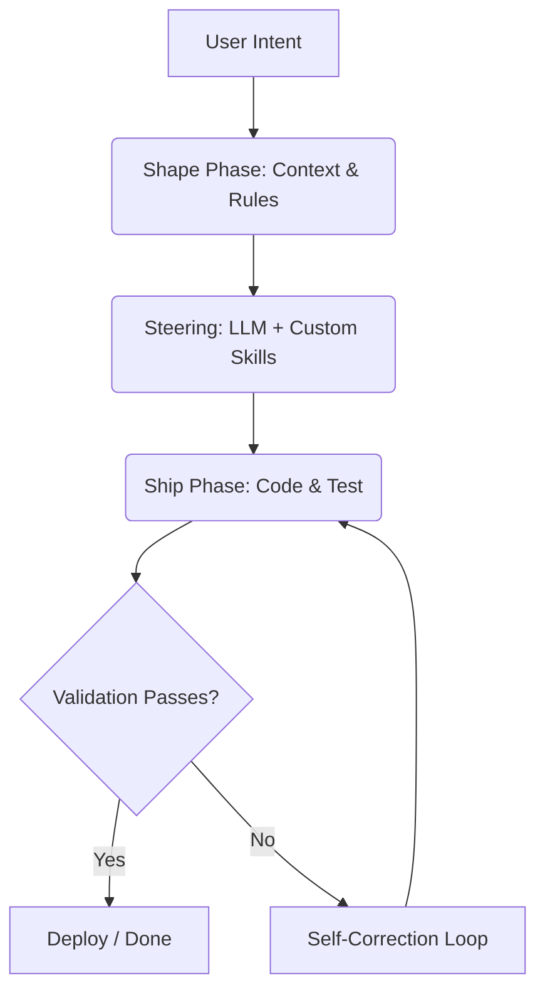

# AI Workflows & "Shape & Ship"

Welcome to the core of the **AI Workflow Curriculum**. Here, we discuss the mental models, methodologies, and orchestration patterns required to build applications successfully in pair-programming environments with AI agents.

Incurable curiosity drives our stack, but structure is what allows us to deliver high-quality code. At Incrementic, we refer to this cycle as the **Shape & Ship** methodology.

---

## What is an AI Workflow?

An **AI Workflow** is a structured, repeatable sequence of actions combining human direction, automated tools, and LLMs (Large Language Models) to accomplish developer tasks. 

Unlike simple chat interfaces, modern AI workflows leverage **agentic frameworks** capable of reading files, executing shell commands, analyzing codebases, and self-correcting errors.

---

## The "Shape & Ship" Methodology

Developing software alongside agentic coders requires a shift in how we structure tasks. Rather than writing raw code ourselves, we **shape** the constraints and guidelines, then let the AI **ship** the implementation.

| Phase | Developer Role | AI Agent Role | Key Artifacts |
| :--- | :--- | :--- | :--- |
| **Shape** | Define scope, architectural guidelines, constraints, and success metrics. | Analyze existing files, query APIs, search documentation, suggest schemas. | `SKILL.md`, `brand.json`, config schemas. |
| **Ship** | Review code changes, approve shell commands, perform integration tests. | Generate source code, compile, resolve lint errors, run local test suites. | Component files, tests, build outputs. |

### Phase 1: Shaper (Human)
As a Shaper, you establish boundaries. Agents are extremely fast at writing code, but they lack human intuition about product requirements or aesthetic taste. 
- You provide the **brand constraints** (e.g., [Incrementic Brand Guide](https://brand.incrementic.com)).
- You provide the **architectural patterns** (e.g., using `uv` over `pip` for Python tool management).
- You write or feed machine-readable **AI Skills** to keep agents aligned.

### Phase 2: Shipper (Agent)
As a Shipper, the agent executes the instruction set. It reads the files, generates the diff blocks, runs the compilers, and validates that the solution matches the provided constraints.

:::tip Avoid Micromanagement
Instead of telling an agent *how* to write every line of code, shape the input files, dependencies, and lint rules, then let the agent figure out the syntax and structure.
:::

---

## Core Principles

When orchestrating AI Workflows, we adhere to the five core company principles:

1. **Plain over Clever:** Write explicit prompts and readable code. Clever tricks confuse models. Plain instructions produce reliable outcomes.
2. **Curious, Forward-Moving:** Always explore the next optimal pattern.
3. **Brief:** Keep instructions short, concise, and focused.
4. **Honest:** Provide direct feedback. If the agent's code is buggy, state the error clearly without padding.
5. **People over Pixels:** Keep the developer experience at the center. AI workflows should reduce friction, not add administrative overhead.

---

## Next Steps

Now that you understand the foundational **Shape & Ship** methodology, proceed to the next parts of the curriculum:
- **[Using AI Skills](./using-skills.md)**: Learn how to load and feed predefined guidelines to coding agents.
- **[Creating AI Skills](./creating-skills.md)**: Learn how to draft and validate your own machine-readable guidelines for any project.
